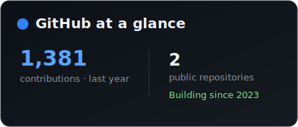
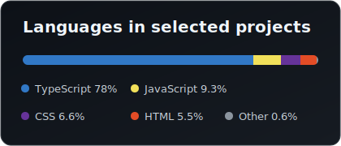

# Hey, I'm Jesse 👋

### I turn ambitious ideas into useful software.

I'm a product-minded developer working at the intersection of AI, operations, and thoughtful user experience. I like automating manual workflows, finding ways to cut costs or increase revenue, and handling the full stack. I'm comfortable with big data and complex operations. What matters most to me is working on things that impact people, alleviate pain and suffering, and make the world a better place.

## What I'm building

- 🛡️ **AI-powered cyberbullying advice** — turning what I learned from my first startup and years in the field into practical, accessible guidance
  - 📖 **[The Bully Stops Here](https://thebullystopshere.com/)** — my free illustrated anti-bullying book website, with practical help for teens, young adults, parents, and educators. It hosts the first iteration of automated bullying advice at scale. 
- 📸 **Photo-rating systems** — multi-role tools for collecting ratings on photos and semi-automated photo-labeling workflows that maximize accuracy for subjective queries
- 🤖 **AI-powered CRM** — automating research, qualification, outreach, and operational workflows

## How I work

`TypeScript` · `React` · `Next.js` · `Node.js` · `PostgreSQL` · `AI workflows` · `Product design`

## GitHub at a glance

